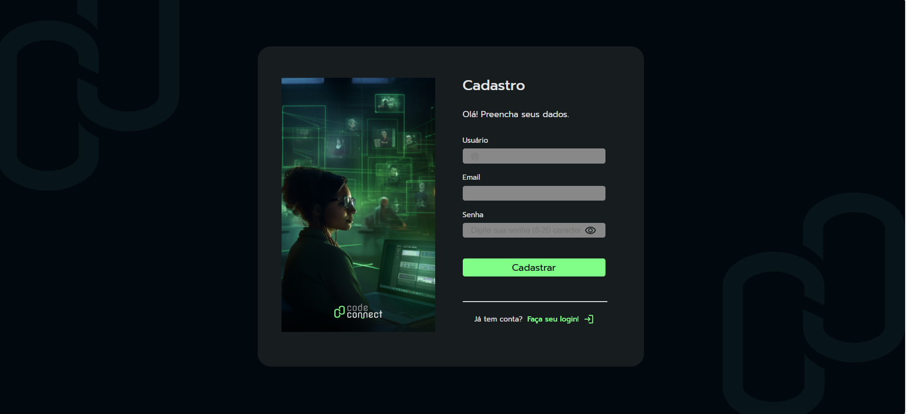
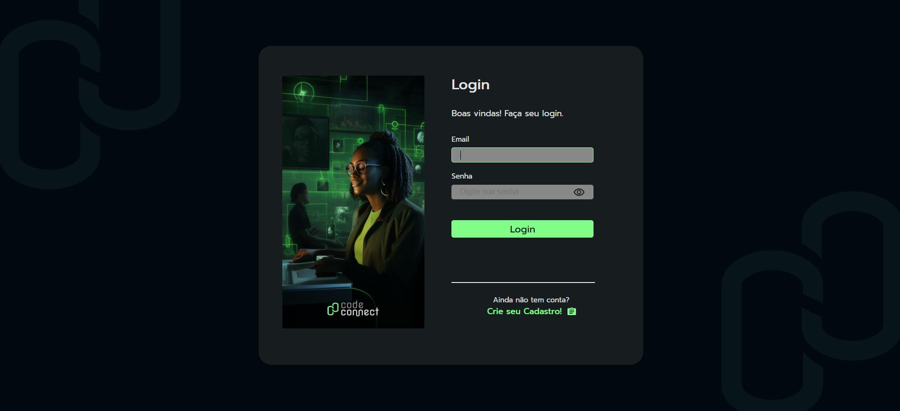
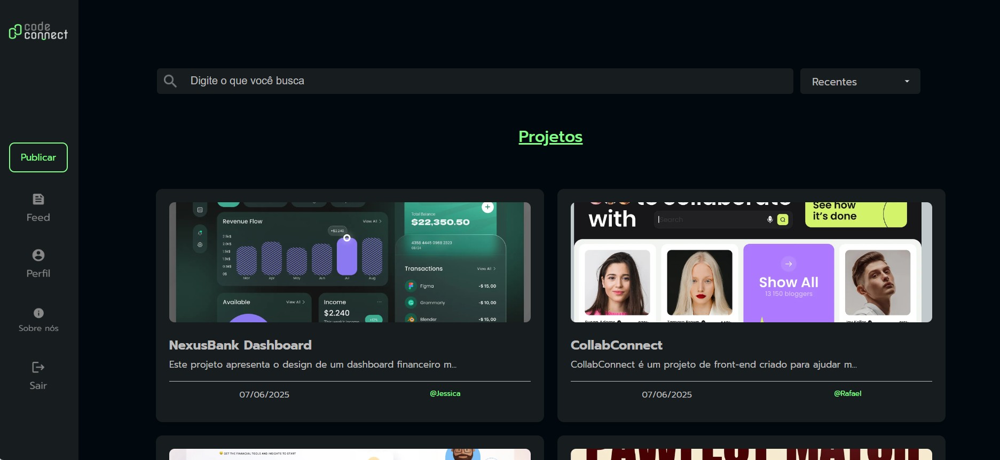
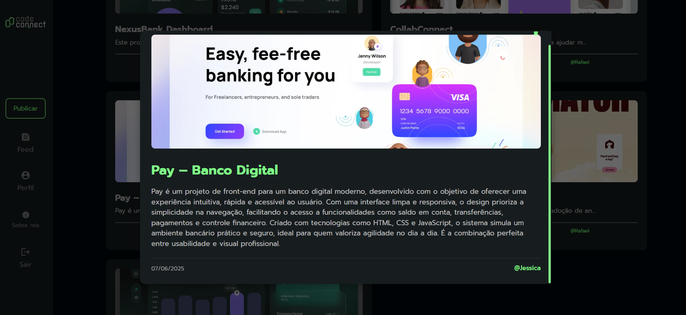
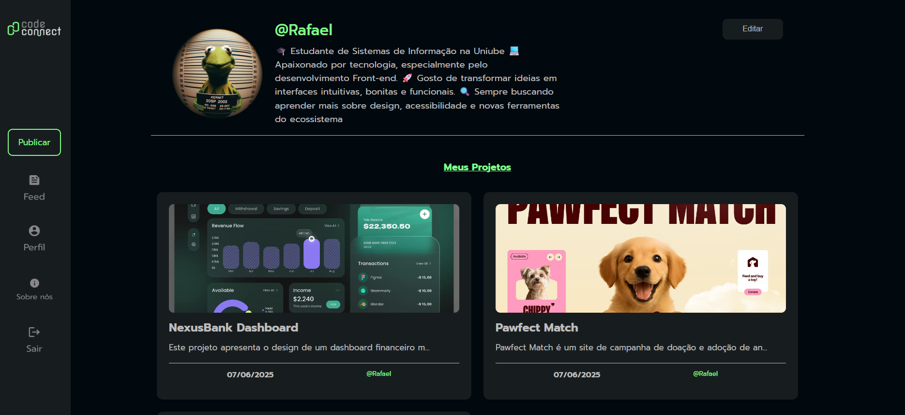
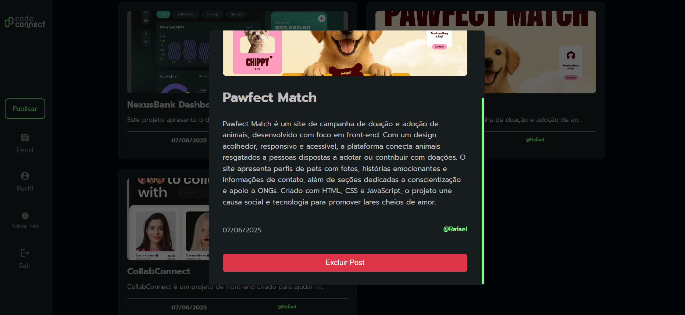

# CodeConnect

**CodeConnect** é uma plataforma web colaborativa para desenvolvedores compartilharem projetos, portfólios e experiências. O sistema permite cadastro, login, publicação de projetos, visualização de feed, edição de perfil e interação com outros usuários.

## Sumário

- [Funcionalidades](#funcionalidades)
- [Estrutura de Pastas](#estrutura-de-pastas)
- [Como Rodar o Projeto](#como-rodar-o-projeto)
- [Principais Telas](#principais-telas)
- [Detalhes Técnicos](#detalhes-técnicos)
- [Acessibilidade](#acessibilidade)
- [Figma](#figma)
- [Contato](#contato)

---

## Funcionalidades

- Cadastro e login de usuários
- Edição de perfil com foto, nome e descrição
- Publicação de projetos com imagem, nome e descrição
- Visualização de feed de projetos de todos os usuários
- Visualização de perfil próprio e de outros usuários
- Exclusão de projetos próprios
- Responsividade para dispositivos móveis


## 📷 Telas da Aplicação

Abaixo você pode visualizar algumas telas da aplicação, demonstrando o fluxo completo do usuário:

### 1️⃣ Tela de Cadastro  
Permite que novos usuários criem uma conta informando nome, e-mail e senha.  


### 2️⃣ Tela de Login  
Usuários já cadastrados podem acessar suas contas inserindo suas credenciais.  


### 3️⃣ Feed  
Exibe as postagens públicas de todos os usuários em ordem cronológica.  


### 4️⃣ Postagem (card do feed)  
Cada post é mostrado em um card com imagem, título e resumo.  


### 5️⃣ Perfil do Usuário  
Mostra informações do usuário e suas postagens.  


### 6️⃣ Postagens do Perfil  
Lista as postagens feitas por um usuário específico.  


### 7️⃣ Tela de Criar Publicação  
Formulário para criar novas postagens com imagem, título e descrição.  


### 8️⃣ Tela Sobre Nós  
Explica o objetivo do projeto e apresenta os responsáveis pelo desenvolvimento.  


## Estrutura de Pastas

```
/
├── assets/
│   ├── css/         # Arquivos de estilos (CSS)
│   ├── img/         # Imagens do projeto
│   └── js/          # Scripts JavaScript
├── pages/           # Páginas HTML do sistema
├── favicon.ico
├── index.html
├── README.md
└── CNAME
```

- **assets/css/**: Estilos para cada página e componentes globais.
- **assets/js/**: Scripts para cada funcionalidade/página.
- **assets/img/**: Imagens organizadas por contexto (perfil, feed, cadastro, etc).
- **pages/**: HTMLs das páginas principais (cadastro, login, feed, perfil, publicar, sobre).

## Como Rodar o Projeto

1. **Pré-requisitos:**  
   - Navegador moderno (Chrome, Firefox, Edge, etc)
   - Não requer backend local (usa API hospedada)

2. **Passos:**
   - Clone ou baixe o repositório.
   - Abra o arquivo [index.html](index.html) ou acesse diretamente as páginas em [pages/](pages/).
   - Para funcionalidades completas, acesse via [pages/login.html](pages/login.html) e faça login/cadastro.

## Principais Telas

- **Cadastro:** [pages/cadastro.html](pages/cadastro.html)
- **Login:** [pages/login.html](pages/login.html)
- **Feed:** [pages/feed.html](pages/feed.html)
- **Perfil:** [pages/perfil.html](pages/perfil.html)
- **Publicar Projeto:** [pages/publicar.html](pages/publicar.html)
- **Sobre:** [pages/sobre.html](pages/sobre.html)

## Detalhes Técnicos

- **Frontend:** HTML5, CSS3, JavaScript (ES6+)
- **API:** Consome endpoints REST hospedados (ver URLs em arquivos JS)
- **Upload de Imagens:** Utiliza Cloudinary para upload de fotos de perfil e projetos
- **Autenticação:** JWT salvo em localStorage
- **Componentização:** Scripts separados por página ([assets/js/](assets/js/))
- **Estilos:** CSS modularizado por página, com variáveis globais ([assets/css/global.css](assets/css/global.css))

## Acessibilidade

- Uso de `aria-label`, `aria-live` e roles em formulários e botões
- Mensagens de feedback visuais e auditivas
- Navegação por teclado suportada

## Figma

O design do projeto foi seguido conforme o protótipo no Figma:
[Protótipo Figma - CodeConnect](https://www.figma.com/proto/YcKgQqPtXEqOVeU7jMmiA9/CodeConnect?node-id=2398-2577&p=f&t=Uy0vL6EahNo8WGqe-1&scaling=min-zoom&content-scaling=fixed&page-id=155%3A3098)


---

> **Observação:**  
> Este projeto é um exemplo educacional e pode ser expandido conforme as necessidades da comunidade.
